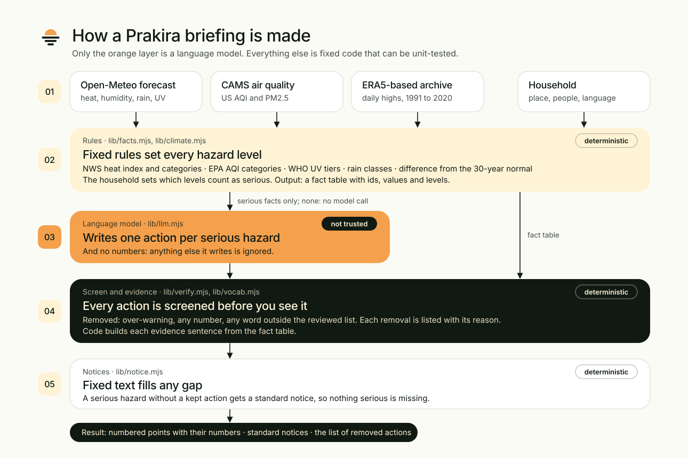

<p></p>

**Climate briefings with receipts.** Prakira turns the next 72 hours of heat, rain, air quality and UV into a few actions for one household, in English or Bahasa Indonesia, and shows the numbers behind every action.

ForgeHacks 2026 · track: AI + Climate

- **Live demo:** https://prakira.rofihosted.space (self-hosted on a small home server; 10 briefings per 10 minutes per visitor)
- **Why it exists and the research behind it:** https://prakira.rofihosted.space/about
- **Screenshots:** [`docs/screenshots/`](docs/screenshots/)


## The idea in one paragraph

Open forecast data can tell you that the heat index will reach 37 °C and the air quality index 204. It does not tell you what that means for an older adult, a toddler, or someone who works outdoors. A language model can write that advice, and it can also state a number that was never in the forecast. In Prakira, fixed published rules set every hazard level, the model only writes the actions, and a checker removes any claim whose numbers or level do not match the data. You see what passed, what was removed, and why.

## How it works



1. **Data.** Forecast, air quality and a 30-year climate archive from Open-Meteo (no API key).
2. **Rules** (`lib/facts.mjs`, `lib/climate.mjs`). Compute the heat index, hazard levels, the difference from the 1991 to 2020 normal, and a flag for days when strong heat and polluted air coincide. The household you choose changes which levels count as serious.
3. **Model** (`lib/llm.mjs`). Mistral `open-mistral-nemo` writes one short action per serious hazard and cites the facts it relies on. If nothing is serious, the model is not called and no advice is given.
4. **Verifier** (`lib/verify.mjs`). Model output is untrusted. A claim is kept only if all of these hold:
   - every cited fact exists and all belong to one hazard;
   - the stated level equals the rule-based level;
   - every number in the evidence matches a cited value, and every cited day's value is stated;
   - the action contains no digits;
   - the action does not say "stay indoors" at a level too low to justify it.
5. **Notices** (`lib/notice.mjs`). Any serious hazard the model did not cover gets fixed-template text, so nothing serious is silently missing.

**The process is visible.** The server reports each of these steps as it happens (`lib/trace.mjs`, sent as an event stream), with measured durations and real counts. The page shows them live while you wait and keeps them as one line above the result; each segment opens its part of the audit trail.

**Also in the tool:** the hour when heat and UV peak (from hourly data, set by rule); "use my location"; place, household and language remembered in the browser only; share to WhatsApp or copy as text; and a long-range card comparing hot days a year in 2011 to 2020 and 2041 to 2050 across three climate models.

## Sources for the hazard levels

| Hazard | What is shown | Level rule | Source (checked 2026-10-07) |
|---|---|---|---|
| Heat | Daily peak of the hourly NWS heat index, from temperature and humidity | Below 80 °F low; 80 to 89 caution; 90 to 102 extreme caution; 103 to 124 danger; 125 and above extreme danger | [NWS formula](https://www.wpc.ncep.noaa.gov/html/heatindex_equation.shtml), [NWS categories](https://www.weather.gov/ama/heatindex). Unit tests reproduce the two examples NWS publishes. |
| Air | Highest hourly US AQI of the day (Open-Meteo applies the EPA averaging periods) | EPA categories, 0 to 50 good up to above 300 hazardous | [AirNow](https://www.airnow.gov/aqi/aqi-basics/), [Open-Meteo air quality docs](https://open-meteo.com/en/docs/air-quality-api) |
| UV | Daily maximum UV index, rounded | WHO action tiers: 0 to 2 low; 3 to 7 protection needed; 8 and above extra protection needed | [WHO](https://www.who.int/news-room/questions-and-answers/item/radiation-the-ultraviolet-(uv)-index) |
| Rain | Daily total with the day's peak rain probability | Below 1 mm little or no rain; to 20 light; to 50 moderate; to 100 heavy; to 150 very heavy; above extreme | **Not verified against a primary source.** Commonly quoted BMKG daily classes; only the 150 mm threshold was corroborated, through news reports. Not a flood forecast. |
| Climate | Forecast daily maximum minus the 1991 to 2020 average for the same week | No level; context only | Open-Meteo archive (ERA5-based). Forecast and archive are different models, so part of the difference is model bias. |

The household adjustments (for example, an older adult lowers the heat threshold from "extreme caution" to "caution") are this project's judgement from the wording of the NWS and EPA categories. They are not an official rule.

## Evaluation

All runs on 2026-10-08 with live data, after the verifier was last tightened. "Tuned" cities are the 20 the system was developed against; "held-out" cities are 15 that were never used while adjusting the prompt or the verifier.

| Metric | English, tuned | English, held-out | Indonesian, tuned | Indonesian, held-out |
|---|---|---|---|---|
| Model claims that pass verification | 31 of 43 (72.1%) | 23 of 28 (82.1%) | 34 of 43 (79.1%) | 24 of 27 (88.9%) |
| Serious hazards covered by a verified model claim | 70.3% | 78.2% | 80.5% | 87.2% |
| Serious hazards covered once notices are added | 100% | 100% | 100% | 100% |
| Deliberately corrupted claims caught by the verifier | 100% | 100% | 100% | 100% |
| Reading grade (Flesch-Kincaid): median; share at grade 8 or below | 3.5; 100% | 3.5; 100% | not computed | not computed |

How to read this honestly:

- **Small samples, one run each, and noisy.** 27 to 43 claims per run. The same English tuned set gave 84.1% the day before and 72.1% here, with only one of the extra rejections due to the new rule. Treat every figure as plus or minus ten points.
- **Coverage with notices is 100% by construction.** It shows the fallback works, not that the model is complete.
- **The catch rate covers two kinds of corruption only:** a shifted number and a wrong level.
- **The reading grade** uses a syllable heuristic and is valid for English only. Before one prompt change it was a median of 8.4 with 47.6% at grade 8 or below.
- **Why claims are rejected** (29 across the four runs): "stay indoors" at too low a level 8; stated level not matching the rule 5; a fact id that does not exist 4; a number written for the wrong day 4; missing evidence 3; mixed hazards 2; a number in the advice 1; a number not in the data 1; a cited value not stated 1.
- **A bug the evaluation did not catch.** Until 8 October the verifier accepted a sentence whose numbers were all real but attached to the wrong days ("224 today, 219 tomorrow" when the data said 219 today and 224 the day after). It was found by looking at a live result, and the verifier now ties each number to the day it is written next to. Results from before that fix, including the 83% and 97% shown earlier, are in [`PLAN.md`](PLAN.md), section 8.

**Review of the advice itself:** 22 claims from 12 briefings were read by the AI assistant used to build the project, not by a person or a clinician. 20 actions read as sensible, 2 as questionable, 0 as clearly unsafe. Details and the two questionable cases are in [`docs/manual-review.md`](docs/manual-review.md). A human review has not been done.

## Limits

- **The wording of each action is not verified.** Only its numbers, its level, the absence of digits, and one proportionality rule are checked. A poor or over-cautious action can pass.
- **Numbers are tied to days by a heuristic.** Each number must match the value for the nearest day word in its sentence (English and Indonesian day words and weekday names). A sentence that names several days and then lists several numbers is rejected. An unusual sentence shape could still slip through.
- **Free data limits.** Open-Meteo counts a multi-decade request as many calls against a free daily limit. The 30-year normal and the long-range outlook are fetched once per place and cached on disk; when the limit is reached the page says so and the briefing still works.
- **The long-range outlook is model output:** the median of three climate models on a high-emissions pathway, for daily maximum air temperature, in two 10-year windows. It is context, not a prediction for your home.
- **One action per hazard.** Advice for one hazard can conflict with another (closing windows against bad air in a hot home without air conditioning). A compound-day notice flags the overlap but does not resolve it.
- **Model forecasts, not sensors.** Air quality comes from CAMS at about 11 km in Europe and 45 km elsewhere.
- **Not an official warning and not medical advice.** It is a companion to your national meteorological service.
- **Free-tier services.** The model key and the data APIs are rate-limited; the demo can be slow or briefly unavailable. If the model fails, the page still shows the hazard levels and notices.
- **Not proven new.** ClimApp and HEAT-SHIELD already give personalised forecast-based heat warnings without a language model, and research prototypes use language models for single-hazard advisories. We did not find this combination (multi-hazard, per-claim numeric verification with visible rejections, a public evaluation) in a search of one database. See [`docs/climate-novelty-literature.md`](docs/climate-novelty-literature.md).

## Run it

Needs Node.js 20 or newer. No dependencies to install.

```bash
git clone https://github.com/rofiperlungoding/prakira && cd prakira
echo "MISTRAL_API_KEY=your_key" > .env      # a free-tier key from console.mistral.ai works
npm start                                   # http://localhost:3000
```

```bash
npm test                       # 41 unit tests, offline
npm run eval -- 15 en heldout  # live evaluation: [count] [en|id] [tuned|heldout]
```

Environment variables: `MISTRAL_API_KEY` (required), `MISTRAL_MODEL` (default `open-mistral-nemo`), `PORT` (default 3000), `HOST` (default 127.0.0.1).

## Repository map

```text
server.mjs            HTTP server: /, /about, /healthz, /api/geocode, /api/brief (JSON or event stream), /api/outlook
public/index.html     Landing page and tool (vanilla JS; model text is inserted as text, never as HTML)
public/about.html     Why it exists and the research behind it
lib/facts.mjs         Data fetch, heat index, hazard levels, household thresholds
lib/climate.mjs       Difference from the 1991 to 2020 normal
lib/llm.mjs           Prompt and model call
lib/verify.mjs        Claim verifier
lib/notice.mjs        Standard notices and the compound-day notice
lib/trace.mjs         Records each real step with its duration, for the live process display
lib/outlook.mjs       Long-range outlook from three climate models
lib/store.mjs         Disk cache for normals and outlooks
lib/readability.mjs   Reading grade, used by the evaluation
lib/*.test.mjs        Unit tests
eval/run.mjs          Live evaluation
docs/                 Literature review, review notes, architecture, logo, screenshots
PLAN.md               Working plan, decisions and the full evaluation record
AGENTS.md             Entry point for AI coding assistants
```

## Provenance and disclosure

- This repository was created on **7 October 2026**, inside the ForgeHacks event window (3 to 10 October), and all code in it was written during the event.
- Before the event the author kept a separate practice repository with an unrelated security-advisory experiment and a generic evaluation harness. **No code was copied from it.** Only principles carried over: treat model output as untrusted, tie claims to source data, show failures, measure with an evaluation.
- **Built with AI coding assistance (Claude Code).** The assistant wrote most of the code and text under the author's direction, and also did the read-through in `docs/manual-review.md`.
- Data: [Open-Meteo](https://open-meteo.com/) (CC BY 4.0) and the Copernicus Atmosphere Monitoring Service. Model: Mistral API. Literature search: Elsevier Scopus API and OpenAlex. Fonts: Outfit, DM Sans, Caveat (SIL Open Font Licence).
