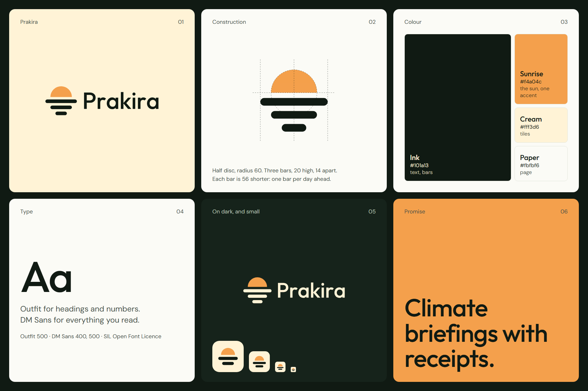

# Prakira brand kit

## The idea

**The sun over the three days ahead.** A half disc above three bars, one bar per day of the briefing. The bars get shorter because a forecast is less certain the further it looks.

The mark replaces the earlier outlined version of the same idea. Three concepts were drawn and tested before this one was chosen: [`logo-concepts.png`](logo-concepts.png).

## Files

| File | Use |
|---|---|
| `prakira-horizontal.svg` | Default. Headers, README, slides. |
| `prakira-stacked.svg` | Square or narrow spaces. |
| `prakira-symbol.svg` | The mark alone, 32 px and larger. |
| `prakira-symbol-small.svg` | The mark below 32 px: two heavier bars so the gaps stay open. |
| `prakira-wordmark.svg` | The name alone. |
| `prakira-horizontal-reversed.svg`, `prakira-symbol-reversed.svg` | On dark backgrounds: cream bars and letters. |
| `variants/` | One-colour black and white lockups, SVG and 1200 px PNG. |
| `web/` | `favicon.ico`, PNG icons from 16 to 512 px, app icon and one-colour symbols. |

The wordmark is outlined Outfit Medium (weight 500). No file needs the font installed.

## Colour

| Name | Hex | Use |
|---|---|---|
| Ink | `#101a13` | Text, the bars, the wordmark |
| Sunrise | `#f4a04c` | The sun. The only accent in the logo. |
| Cream | `#fff3d6` | Icon tile; bars and letters on dark |
| Paper | `#fbfbf6` | Page background |

Sunrise on Paper has low contrast (about 2:1). Use it for the sun and for large shapes, never for text.

## Type

- **Outfit** (500) for headings and numbers.
- **DM Sans** (400, 500) for text.

Both are under the SIL Open Font Licence.

## Rules

- **Clear space:** keep the height of two bars free on every side.
- **Smallest size:** horizontal lockup 96 px wide; symbol 16 px, using the small cut below 32 px.
- **Backgrounds:** Paper, Cream, white, or Ink (reversed files). On a photo or a busy colour, use a one-colour version from `variants/`.
- **Do not** recolour the sun, add an outline or a shadow, change the gap between the bars, set the name in another typeface, or stretch the logo.

## Geometry

256 unit canvas. Half disc of radius 60. Three bars, 20 high and 14 apart, with full round ends; widths 176, 120 and 64, so each is 56 shorter than the one above.

## Limits

- No trademark or similarity search was done for the name or the mark.
- The mark was drawn in code and checked as rendered images at 16 to 900 px in headless Chromium. It was not checked in print.
